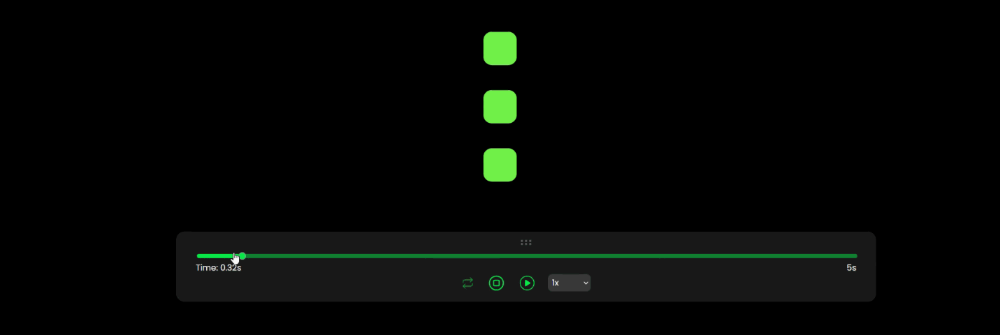

# GSAP Controller Tool

## Overview

The GSAP Controller Tool is a custom utility to help developers debug their GSAP animations, providing an affordable alternative to GSAP DevTools. This tool provides various controls such as play, pause, restart, loop, and speed adjustments to aid in debugging animations efficiently.


## Features

- **Play/Pause**: Start or pause the animation.
- **Restart**: Restart the animation from the beginning.
- **Loop Toggle**: Toggle the looping of the animation.
- **Speed Control**: Adjust the speed of the animation.
- **Slider Control**: Manually control the progress of the animation.
- **Draggable UI**: Move the control panel around the screen.

## Installation

To include this tool in your project, use the following CDN link:
```html
<!-- gsap controller -->
<script src="https://cdn.jsdelivr.net/gh/MuseCraftman/GSAP-Controller/gsapController.js"></script>
```

for styling the controller include the following CDN in the `<head> </head>`
```html
<link rel="stylesheet" href="https://cdn.jsdelivr.net/gh/MuseCraftman/GSAP-Controller/gsapController.css">
```

Ensure you have GSAP and jQuery included in your project as well:
```html
<!-- GSAP -->
<script src="https://cdnjs.cloudflare.com/ajax/libs/gsap/3.9.1/gsap.min.js"></script>
<!-- jQuery -->
<script src="https://cdnjs.cloudflare.com/ajax/libs/jquery/3.6.0/jquery.min.js"></script>
<!-- GSAP Draggable Plugin -->
<script src="https://cdnjs.cloudflare.com/ajax/libs/gsap/3.9.1/Draggable.min.js"></script>
```

## Usage

### Step 1: Initialize Your GSAP Animation

Create your GSAP animation as usual:
```javascript
const myAnimation = gsap.to(".box", { duration: 2, x: 300 });
```

### Step 2: Create Controllers for Your Animation

Invoke the `createController` function with your GSAP animation:
```javascript
// pass the animation you want to control
createController(myAnimation);
```

and **that's it!!**

## Example

here is the complete example:
```html
<!DOCTYPE html>
<html lang="en">
<head>
    <meta charset="UTF-8">
    <meta name="viewport" content="width=device-width, initial-scale=1.0">
    <title>GSAP COntrollers Tool Example</title>
    <link rel="stylesheet" href="https://cdn.jsdelivr.net/gh/MuseCraftman/GSAP-Controller/gsapController.css">
    <style>
        .box {
            width: 100px;
            height: 100px;
            background-color: red;
        }
    </style>
</head>
<body>
    <div class="box"></div>
    
    <script src="https://cdnjs.cloudflare.com/ajax/libs/jquery/3.6.0/jquery.min.js"></script>
    <script src="https://cdnjs.cloudflare.com/ajax/libs/gsap/3.9.1/gsap.min.js"></script>
    <script src="https://cdnjs.cloudflare.com/ajax/libs/gsap/3.9.1/Draggable.min.js"></script>
    <script src="https://cdn.jsdelivr.net/gh/MuseCraftman/GSAP-Controller/gsapController.js"></script>
    <script>
        $(document).ready(function() {
            const myAnimation = gsap.to(".box", { duration: 2, x: 300 });
            createController(myAnimation);
        });
    </script>
</body>
</html>
```

## Contributing

Feel free to contribute to this project by opening issues or submitting pull requests. Contributions are welcome and appreciated!

## Acknowledgements

- [jQuery](https://jquery.com/)
- [GSAP (GreenSock Animation Platform)](https://gsap.com/)

## Contact

For any inquiries or feedback, please reach out from [Twitter](https://x.com/HamzaElmoqaddam)
